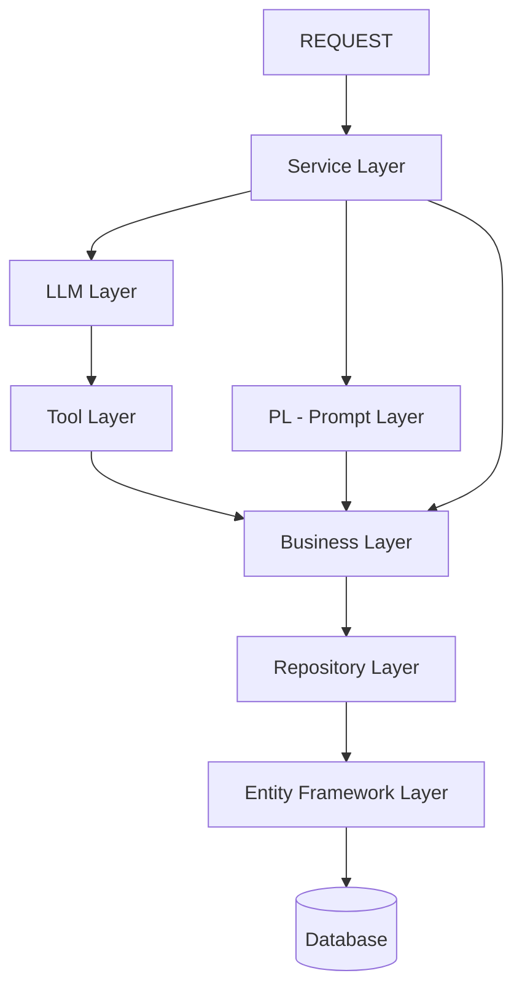
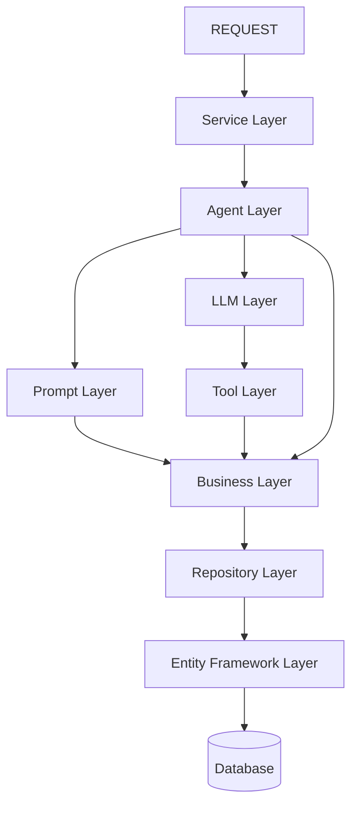

# Service Layer architecture discussion — HC.AI.MAPI (2026-07-17)

**Status: discussion in progress, design only, nothing implemented against this yet.**
Existing code (`HC.AI.MAPI.BL`/`HelloWorldBL`, `Llm/OllamaClient`, `Agents/AgentV0`,
`Tools/HealthcareQueryTool`) predates this discussion and has not been changed to match it yet —
this doc is the architecture conversation, to be reconciled with real code once the design settles.

## Correction (2026-07-17, later same day)

**`PL` means Prompt Layer** — confirmed directly. Earlier passes of this log mislabeled `PL` as
a separate "Rules Layer," treating it as a fourth, distinct box alongside `Prompt Layer`. That
was wrong: `PL` and `Prompt Layer` are the same box. There is currently **no separate
Rules/Guardrail layer** in this design — the sections below are corrected to reflect that. (The
earlier-locked safety requirement from the main design doc — server-side allow-list validation,
read-only enforcement — still needs a home; it simply isn't `PL`. Open item, see bottom.)

## Diagram as given (hand-drawn, described verbally)

```
REQUEST
  -> SL (Service Layer)
       -> LLM -> TOOL -> BL
       -> PL / Prompt Layer -> BL
       -> BL (direct)
  -> BL -> Repository -> EF -> DB
```

## Flow chart (current understanding)



## Confirmed so far

- **SL (Service Layer)** sits directly under the controller/request entry point — this is the
  orchestrator role, roughly where `AgentV0` currently lives in code.
- **Three distinct paths from SL down to BL**:
  1. `SL -> LLM -> TOOL -> BL` — the AI-driven path: LLM decides/builds something, a Tool
     executes it, result reaches the Business Layer.
  2. `SL -> PL (Prompt Layer) -> BL` — the Prompt Layer's job is to fill in the actual prompt
     details (template + real values) before a prompt goes to the LLM; to fill some of those
     details it may itself need to call the Business Layer for reference/context data.
  3. `SL -> BL` directly — a bypass path for requests that don't need AI or prompt-filling at all.
- All three paths converge on the same stack below BL: **`BL -> Repository -> EF -> DB`** —
  unchanged from the existing layered pattern already used elsewhere in the repo (e.g.
  `AI.HealthCare.Patient.API`'s BL/Repositories/EF split).
- Explicitly confirmed: this is not the full picture yet — layers/paths are still being added one
  at a time before the design is locked.

## Open / not yet described (as of the SL-fan-out version above)

- **Prompt Layer's relationship to the LLM Layer, not yet confirmed**: is `Prompt Layer -> BL`
  a fully independent branch from `LLM -> TOOL -> BL`, or does the real sequence run
  `SL -> Prompt Layer -> LLM -> TOOL -> BL` (Prompt Layer builds/fills the prompt first, calling
  BL for context data as needed, then hands the finished prompt to the LLM Layer)? The diagram as
  drawn shows them as separate boxes both hanging off SL, but the verbal description ("prompt
  layer needs to fill the prompt details... before it goes to the LLM") reads more like a
  sequential step. Needs confirmation before implementation.
- How `TOOL` (existing `HealthcareQueryTool`) and this diagram's `TOOL` box reconcile — same
  concept, not yet confirmed.
- Whether `Prompt Layer`'s calls into `BL` for context data risk duplicating what `TOOL` already
  fetches from `BL` after the LLM responds — worth checking once the full flow is locked, so the
  same data isn't fetched twice per request.

## Update — Agent Layer (AL) introduced, alternative approach (2026-07-17, same day)

A second way of structuring the same idea was then proposed: instead of `SL` fanning out
directly to `LLM`, `Prompt Layer`, and `BL`, introduce one consolidating **Agent Layer (AL)**
directly under `SL`. `AL` is the one that decides whether to call the Prompt Layer, the LLM
Layer, or go straight to the Business Layer — those three no longer hang directly off `SL`
themselves.

### Text flow chart (locked as the current preferred version)

```
REQUEST
  -> SL (Service Layer)
       -> AL (Agent Layer)
            -> Prompt Layer -> BL
            -> LLM Layer -> TOOL -> BL
            -> BL (direct)
  -> BL -> Repository -> EF -> DB
```

### Mermaid version (for demo/PPT use)



**Explicitly logged for future demo/PPT/design-doc use, per instruction: this diagram and the one
above it (SL fanning out directly) are both kept in this log as the two versions discussed on
2026-07-17** — this section's AL version is the one described as "the one way of the
implementation" most recently, i.e. currently preferred, but not yet declared final over the
SL-fan-out version.

### Open item raised by this update (superseded — see correction above)

~~Where does `PL` (Rules Layer) sit relative to `AL`?~~ Moot: `PL` = Prompt Layer, already shown
as a child of `AL` in the mermaid diagram above. No separate Rules Layer exists in this design.

## Architect Agent input (2026-07-17, discussion, not yet locked)

- **Recommend the AL-consolidated version over SL-fan-out.** Keeps `SL` thin (no dependency on
  `LLM`/`Prompt`/`Tool` internals); `AL` becomes the single routing decision-maker, which is
  easier to test and gives a clean seam for later growth (e.g. the earlier 9-agent pipeline could
  slot entirely inside `AL` without touching `SL` or `BL`). Also maps cleanly onto Semantic
  Kernel's own model: `AL` ~ the `Kernel` + `FunctionChoiceBehavior.Auto()` deciding whether to
  call a plugin; `Prompt Layer` ~ the system-prompt/`ChatHistory` builder.
- **Open gap, not yet placed anywhere**: the main design doc's locked safety requirement
  (server-side allow-list validation of the LLM's query DSL output, read-only enforcement, record
  limits — see `healthcare_ai_assistant_mcp_ollama_design.md` §4) still needs a home in this
  diagram. Candidates to discuss next: inside `TOOL` (validate before calling BL), inside `AL`
  (as a step between LLM and TOOL), or as its own explicit layer — this is a different concern
  from `PL`/Prompt Layer and hasn't been assigned a box yet.
- Still standing from earlier: whether `Prompt Layer`'s `BL` calls (for context to fill the
  prompt) duplicate what `TOOL` fetches from `BL` after the LLM responds — worth resolving once
  `AL`'s internal sequencing (parallel vs. sequential Prompt→LLM) is confirmed.

## Persona Controllers — created, questions parked for later (2026-07-17)

8 empty `UC*Controller` classes created under `HC.AI.MAPI/Controllers/` (`UC` = "Your Co-pilot"),
one per persona/access-pattern discussed: `UCDoctorController`, `UCPatientController`,
`UCProviderController`, `UCHospitalController`, `UCInsuranceProviderController`,
`UCUserController`, `UCClientController`, `UCAnonymousController`. Structural only — no action
methods, no routing logic yet.

**Confirmed**: `UCDoctorController` is the **primary client** of this system — a doctor's
questions get a dedicated, higher-accuracy prompt/guardrail treatment specifically because wrong
information has real clinical consequences. `UCProviderController` is a separate, more generic
concern (general access to `Provider` entity data), not the doctor-as-chat-user experience.

**Parked for a future client discussion** (not yet resolved, explicitly deferred rather than
guessed at):
- What should a client be told `UCClientController` actually serves — another name for the
  Patient persona (redundant with `UCPatientController`), or a non-chat, machine-to-machine API
  consumer (external system integration)?
- Does the Guardrail Layer's allow-list need to differ per persona/controller (e.g. a Patient
  persona should never be able to query another patient's `Condition` rows, but a Doctor persona
  might need to) — this is the real design question the persona-controller list feeds into, not
  solved by having separate controllers alone.

## References

- Prior LLM-layer worklog entry (same day): [`2026-07-17_mapi_folder_scaffold_and_llm_layer.md`](2026-07-17_mapi_folder_scaffold_and_llm_layer.md)
- Main plan/discussion log: [`2026-07-16_patient_ai_assistant_plan.md`](2026-07-16_patient_ai_assistant_plan.md)
- Source: [`hc_ai_in/mapi/HC.AI.MAPI/`](../../../../hc_ai_in/mapi/HC.AI.MAPI/)
