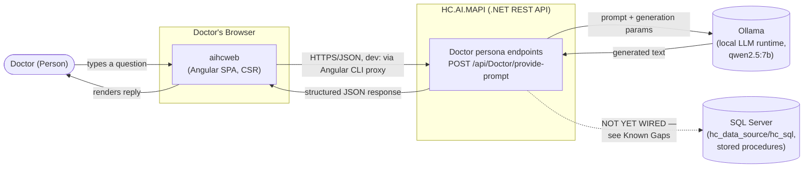
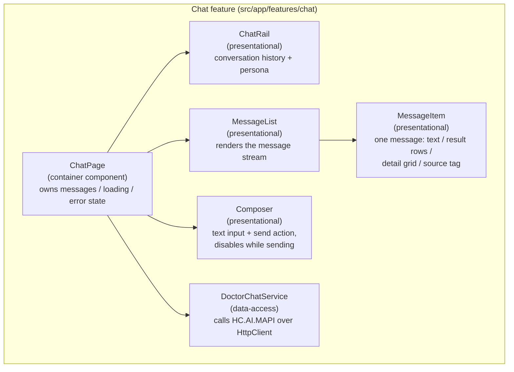

# aihcweb — Architecture Design Document

Covers `hc_ui/aihcweb`, the Angular chat UI for the Doctor persona ([US008](../../hc_agile/product_owner/user_stories/US008_chat_ui_doctor_persona.md)),
and how it fits into the wider system. Written at C4-model **Container (C2)** and **Component
(C3)** level — boxes, responsibilities, and data flow — not source code.

---

## 1. System context

**Who uses it:** a Doctor, through a browser, asking natural-language questions (patient lookups,
recent visits, clinical data) instead of using a separate screen or API call per question type.

**What it talks to:** `HC.AI.MAPI` (a .NET REST API), which in turn talks to a local LLM (Ollama)
today, with a database layer (SQL Server) that exists but is not yet wired into the live request
path (see §5, Known Gaps).

---

## 2. Container diagram (C2)

| Container | Technology | Responsibility |
|---|---|---|
| `aihcweb` | Angular 21, TypeScript, CSR | Chat UI: message list, composer, conversation history, loading/error states |
| `HC.AI.MAPI` | ASP.NET Core (.NET) | Validates requests, resolves which LLM/provider answers, orchestrates the call, returns a structured response |
| Ollama | Local LLM runtime | Runs the actual language model (`qwen2.5:7b`) and generates text |
| SQL Server | `hc_data_source/hc_sql` | Holds patient/encounter data and a whitelisted, guardrail-validated query procedure — **built, but not yet called from the Doctor chat flow** |

**Development-time detail worth flagging to a client asking about deployment:** in development,
`aihcweb` and `HC.AI.MAPI` run on different ports (`4200` and `5150`), so the Angular CLI's dev
server proxies `/api/*` requests to the .NET API — this keeps the browser's requests same-origin
and avoids needing CORS configuration on the .NET side during development. **Production topology
(same-origin deployment vs. reverse proxy vs. CORS-enabled API) is not yet decided** — an open
question for Architect/DevOps, not resolved by this document.

---

## 3. Component diagram (C3) — inside `aihcweb`

| Component | Role | Responsibility |
|---|---|---|
| `ChatPage` | Container ("smart") component | Owns all state (message list, sending/loading flag, error message); the only component that talks to `DoctorChatService` |
| `ChatRail` | Presentational | Static conversation-history list and persona display |
| `MessageList` | Presentational | Iterates and renders the message stream |
| `MessageItem` | Presentational | Renders one message — plain text, a result list, a detail grid, or a source-attribution tag, depending on what the reply contains |
| `Composer` | Presentational | Text input + send button; exposes a `disabled` state so `ChatPage` can lock it while a request is in flight |
| `DoctorChatService` | Data-access | The only component with network knowledge — talks to `HC.AI.MAPI`, keeps HTTP concerns out of every UI component |

**Why the container/presentational split:** every component except `ChatPage` and
`DoctorChatService` has no knowledge of the network, loading state, or error handling — they only
render what they're given and emit events upward. This is what let the chat UI be built and
visually reviewed against **mock data** before the backend contract existed, then reconnected to
the **real API** later by changing only `ChatPage`, with zero changes to the presentational
components.

---

## 4. Data flow — sending a message

1. Doctor types a message into `Composer` and submits (click or Enter).
2. `Composer` emits the trimmed text upward; `ChatPage` immediately appends it to the message list
   as a "user" message and disables `Composer`.
3. `ChatPage` calls `DoctorChatService`, which sends the request to `HC.AI.MAPI`
   (`POST /api/Doctor/provide-prompt`) — in development, through the Angular CLI's dev proxy.
4. `HC.AI.MAPI` validates the request, resolves the LLM provider/model, calls Ollama, and returns
   a structured response (content, model used, latency, success flag).
5. On success: `ChatPage` appends the reply as an "assistant" message and re-enables `Composer`.
   On failure: `ChatPage` shows an inline error banner instead — network failure, a validation
   error from the API, and other HTTP errors are surfaced as three distinct, human-readable
   messages rather than one generic failure state.

**A client would reasonably ask: "what does the Doctor see while waiting?"** — Local LLM calls
currently take up to ~30 seconds. The composer shows a disabled "Sending…" state, and a status
line reads *"Thinking… local Ollama responses currently take up to ~30s"* so the wait doesn't
read as broken.

---

## 5. Key architecture decisions

| Decision | Rationale |
|---|---|
| Standalone components, no `NgModule` anywhere | Current Angular-recommended default; less boilerplate, matches what `@angular/cli@21`'s own generator produces |
| Signals for local state (`messages`, `isSending`, `errorMessage`) | Fine-grained reactivity, simpler than RxJS `Subject`s for state that's purely local to one page |
| `features/<feature>/{pages,components,data,models}` folder convention | Keeps container vs. presentational vs. data-access components clearly separated; captured as a draft in `NAMING_CONVENTION.md`, pending formal Architect sign-off |
| Dev-time CLI proxy instead of CORS headers on the API | Avoids a cross-cutting change to the .NET project from the Angular side during development; **not** a production deployment decision (see §2) |
| Mock-data-first delivery | The chat UI (layout, components, interaction) was built and demoed against static mock data *before* the backend endpoint contract existed, then swapped to the real HTTP call once the backend was verified live — this decoupled UI progress from backend sequencing |
| Pure CSR, no SSR | Right call for an internal, authenticated clinical tool — SEO is irrelevant, every user has a session already, and it avoids operating a Node.js SSR server for no real benefit |

---

## 6. Known gaps (stated plainly, the way a client would ask about them)

- **"Does the assistant actually look at real patient records?"** — Not yet. The current backend
  module (`HC.AI.MAPI` "Module 1") proves the request → LLM → response pipeline end-to-end, but
  does not yet call the database or the guardrail-validated query procedure. The UI's header
  badge says *"LLM only — not database-grounded yet"* specifically so this isn't misrepresented.
- **"Is this authenticated? Could two doctors' sessions get mixed up?"** — No authentication or
  session/user scoping is wired into the UI or the API calls yet — there is currently one implicit
  persona.
- **"What happens if the LLM is slow, or down?"** — Handled: a loading state and three distinct
  error paths (network failure, request validation error, other HTTP errors). **Not yet handled:**
  automatic retry, request cancellation, or backoff.
- **"Is it accessible / usable on mobile?"** — The layout collapses the conversation-history rail
  below a 760px viewport width, and interactive elements have visible focus states. No formal
  accessibility audit (screen reader testing, WCAG conformance check) has been done yet.
- **"What's the test coverage?"** — Unit tests cover component behavior and the data-access layer
  (HTTP success, network failure, and validation-error paths are all tested via
  `HttpTestingController`, not just the happy path). No end-to-end/integration test suite exists
  yet for this feature — tracked as an open item in QA's test plan.

---

## 7. Source references

- [US008 — Chat UI for Doctor Persona](../../hc_agile/product_owner/user_stories/US008_chat_ui_doctor_persona.md) — full acceptance criteria and the confirmed endpoint contract
- [US007 — Healthcare AI Assistant](../../hc_agile/product_owner/user_stories/US007_healthcare_ai_assistant.md) — the backend feature this UI consumes
- [Dev Angular worklogs](../../hc_agile/worklogs/dev_angular/) — chronological build history
- [BACKLOG.md, PB020](../../hc_agile/product_owner/backlog/BACKLOG.md) — the database-grounding gap referenced in §6
